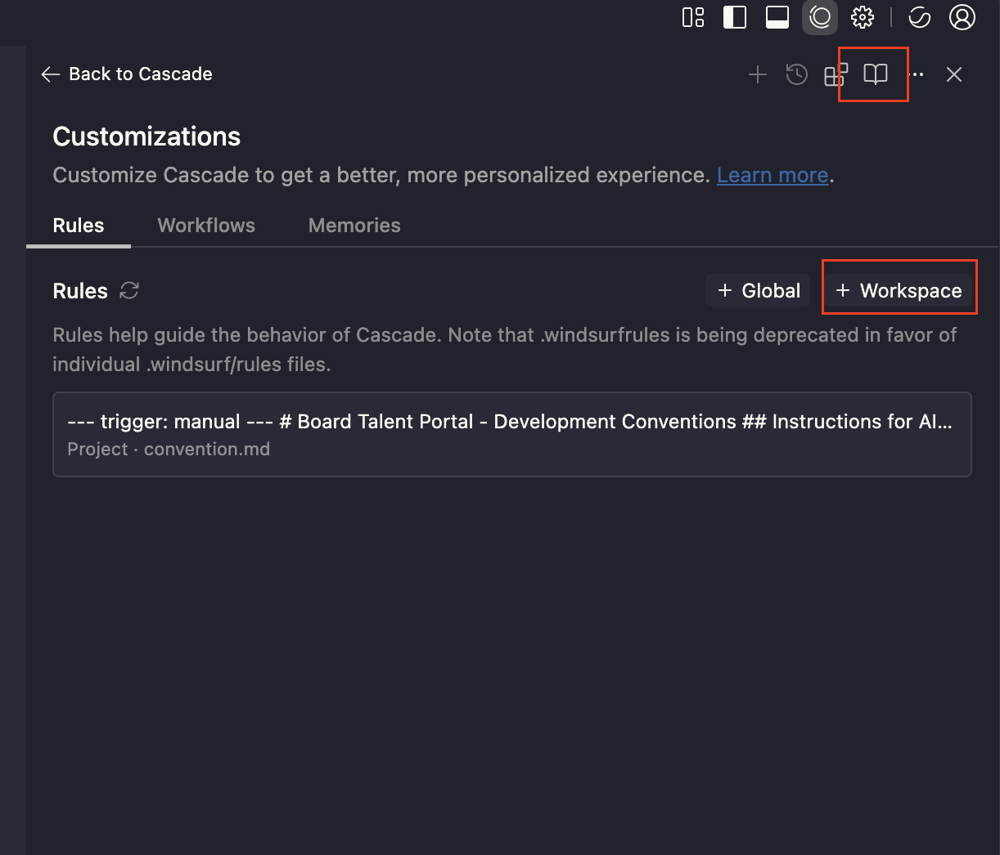

# Windsurf Setup for Existing Project


## Using Windsurf Effectively for Existing Project
Purpose:
To enhance project documentation, ensure adherence to best practices, maintain consistent code quality, and streamline ongoing development and maintenance processes within your existing project. It helps keep the project well-organized, up-to-date, and aligned with industry standards.

### 1. Overview
Windsurf can assist existing projects by:

- Documenting the current setup and configuration.
- Enforcing best practices and code standards.
- Generating or updating documentation like README.md.
- Analyzing the codebase to create or refine a project conventions file (convention.md).
- Ensuring ongoing consistency in code quality and structure.
- Facilitating smooth maintenance and onboarding for current project teams.

### 2. Step-by-Step Process
### 2.1 – Analyze To Create Rules
Purpose:
to provide explicit context, guidance, and constraints to its AI agent, Cascade. This ensures the AI's output is accurate, consistent, and tailored to your specific project and coding preferences, preventing it from generating generic or incorrect suggestions.

What Effect if you’re not set rules on windsurf?
When you ask to create code for fixing and new feature it would change existing code rewriting by Cascade minimal it would your code really diferent code style and worst case it would make current feature not working becase some of code rewriting by Cascade
Example Prompt (Use Thinking model in my case I used Claude Sonnet 4.5 Thinking):

```
Analyze this project and create IDE rules base on this template:
- Instructions for AI Assistants (When generate code if any function of library included check versioning of that library)
- Code Style & Structure
- Language Configuration (ex: Typescript)
- Naming Conventions
- State Mnagement
- UI & Styling
- Performance Optimization
- Form & Validations
- Error Handling and Validation
- Transalations
- Services and HTTP Call
```
Here is the result:

``````
# Transaction One - IDE AI Assistant Rules
# Project: 1Transaction Tax Management System
# Version: 0.129.0
# Stack: Vue 2.7.16 + TypeScript 5.1.6 + Vite 4.3.9

## Instructions for AI Assistants

### Critical Version Rules
1. **ALWAYS verify library versions before suggesting code**
2. **Vue 2.7.16** - NOT Vue 3 (different API)
3. **Vuetify 2.6.15** - NOT Vuetify 3 (different components)
4. **AG Grid 28.2.1** - NOT v29+ (breaking changes)
5. **ALWAYS use TypeScript** - No plain JavaScript
6. **PREFER minimal edits** - Don't rewrite entire files
7. **NO emojis in code** - Only in docs if requested

### Library Versions to Check
- vue@2.7.16, vuetify@2.6.15, @ag-grid-community/*@28.2.1
- pinia@2.0.35, axios@1.4.0, @tanstack/vue-query@4.29.7
- @vuelidate/core@2.0.3, lodash@4.17.21, dayjs@1.11.10

---

## Code Style & Structure

### Import Order (auto-sorted by Prettier)
```typescript
// 1. Type imports (import type)
import type { GridApi } from '@ag-grid-community/core';

// 2. External libs (sorted)
import { ref, computed } from 'vue';
import { storeToRefs } from 'pinia';

// 3. @/app/*
import config from '@/app/config';

// 4. @/common/*
import http from '@/common/http';

// 5. @/* (modules)
import { useMyStore } from '@/Module/stores';

// 6. @v4/*
import Component from '@v4/common/components/Component.vue';

// 7. Relative (./ ../)
import { DEFAULT_FILTER } from '../filter';
```

### Vue Component Structure
```vue
<script setup lang="ts">
// 1. Type imports
// 2. Library imports
// 3. App imports (by alias order)
// 4. Props & Emits (defineProps/defineEmits)
// 5. Composables & Store (with storeToRefs)
// 6. Reactive state (ref, reactive)
// 7. Computed properties
// 8. Watchers
// 9. Methods (grouped by functionality)
// 10. Lifecycle hooks
// 11. defineExpose (if needed)
</script>

<template>
  <!-- Use camelCase for attributes -->
</template>

<style scoped lang="scss">
/* Styles */
</style>

<i18n lang="yaml">
en:
  key: 'English'
id:
  key: 'Indonesian'
</i18n>
```

### Formatting (Prettier)
- Single quotes, 2 spaces, trailing commas
- Import order with separation

---

## Language Configuration

### TypeScript
```typescript
// ✅ Always annotate return types
async function fetchData(id: string): Promise<DataType> {
  return await http.get(`/api/${id}`);
}

// ✅ Annotate refs with complex types
const users = ref<UserInterface[]>([]);

// ✅ Use type for object shapes
type FormData = {
  name: string;
  email: string;
};

// ✅ Use interface for data models
interface UserInterface {
  id: string;
  name: string;
}

// ✅ Use enum for fixed values
enum Status {
  Active = 'active',
  Inactive = 'inactive',
}
```

---

## Naming Conventions

### Files
- Components: `PascalCase.vue`
- Composables: `useCamelCase.ts`
- Services: `camelCaseServices.ts`
- Types/Interfaces: `PascalCaseType.ts` or `PascalCaseInterface.ts`
- Stores: `index.ts` in folder

### Variables
- Variables: `camelCase`
- Constants: `SCREAMING_SNAKE_CASE`
- Booleans: `isActive`, `hasError`, `shouldShow`
- Handlers: `handleClick`, `handleSubmit`

### Types
- Interfaces: `TransactionInterface`
- Types: `FormDataType`
- Enums: `StepPrepopulation`
- Props: `ComponentNameProps`

---

## State Management (Pinia)

```typescript
export const useModuleStore = defineStore('MODULE/NAME', {
  state: () => ({
    data: [] as DataType[],
    loading: false,
    error: null as Error | null,
  }),
  
  getters: {
    filteredData: (state) => state.data.filter(item => item.active),
  },
  
  actions: {
    async loadData(params: ParamsType) {
      this.loading = true;
      try {
        const response = await apiCall(params);
        this.data = response.data;
        return response;
      } catch (error) {
        this.error = error as Error;
        throw error;
      } finally {
        this.loading = false;
      }
    },
  },
});

// Usage in component:
const store = useModuleStore();
const { data, loading } = storeToRefs(store);  // Reactive
const { loadData } = store;  // Actions
```

---

## UI & Styling

### Vuetify 2 Components
```vue
<v-dialog v-model="show" width="90vw" persistent>
  <v-card>
    <v-card-title>Title</v-card-title>
    <v-card-text>Content</v-card-text>
  </v-card>
</v-dialog>

<v-text-field
  v-model="value"
  label="Label"
  outlined
  hideDetails="auto"
  :errorMessages="errors"
/>

<v-btn outlined @click="handleClick">
  <span>Click</span>
</v-btn>

<v-icon>mdi-close</v-icon>
```

### TailwindCSS
```vue
<div class="flex items-center justify-between gap-4 px-6 py-4">
  <span class="text-xl font-bold text-opBlack-200">Title</span>
  <button class="cursor-pointer hover:bg-gray-100">Action</button>
</div>
```

### Custom Colors
- `opRed-400`, `opGray-200`, `opGray-400`
- `opBlack-200`, `opGreen-300`, `opYellow-600`

---

## Performance Optimization

### Lazy Loading
```typescript
// Routes
const routes = [
  {
    path: '/feature',
    component: () => import('@/Feature/views/FeatureView.vue'),
  },
];

// Components
const HeavyComponent = defineAsyncComponent(() =>
  import('./HeavyComponent.vue')
);
```

### Computed & Memoization
```typescript
// Use computed for derived state
const filteredList = computed(() => {
  return list.value.filter(item => item.active);
});

// Debounce expensive operations
import { useDebounceFn } from '@vueuse/core';

const debouncedSearch = useDebounceFn((query: string) => {
  performSearch(query);
}, 300);
```

### AG Grid Optimization
```typescript
// Use server-side row model for large datasets
const datasource = getServerSideDatasource({ getData });
gridApi.value.setServerSideDatasource(datasource);

// Enable virtualization
{
  rowModelType: 'serverSide',
  cacheBlockSize: 100,
  maxBlocksInCache: 10,
}
```

---

## Form & Validations

### Vuelidate Pattern
```typescript
import { useForm } from '@v4/common/composables/useForm';
import { required, email } from '@vuelidate/validators';

type FormValues = {
  email: string;
  name: string;
};

const schema = {
  email: { required, email },
  name: { required },
};

const { formValues, getErrorMessage, submit } = useForm<FormValues>({
  defaultValues: { email: '', name: '' },
  rules: schema,
  resetOnMounted: false,
});

// In template:
<v-text-field
  v-model="formValues.email"
  :errorMessages="getErrorMessage('email')"
/>
```

### Form Submission
```typescript
async function handleSubmit() {
  const isValid = await submit();
  if (!isValid) return;
  
  try {
    await submitData(formValues);
    // Handle success
  } catch (error) {
    // Handle error
  }
}
```

---

## Error Handling and Validation

### API Error Handling
```typescript
async function loadData(id: string) {
  try {
    const response = await http.get(`/api/data/${id}`);
    return response.data;
  } catch (error) {
    // Log error
    console.error('Failed to load data:', error);
    
    // Show user-friendly message
    const message = _.get(error, 'response.data.error.message', 'Unknown error');
    showErrorNotification(message);
    
    // Re-throw or return default
    throw error;
  }
}
```

### Input Validation
```typescript
// Runtime validation with Zod
import { z } from 'zod';

const userSchema = z.object({
  email: z.string().email(),
  age: z.number().min(0).max(120),
});

try {
  const validated = userSchema.parse(input);
} catch (error) {
  if (error instanceof z.ZodError) {
    // Handle validation errors
  }
}
```

### Guard Clauses
```typescript
function processData(data: DataType | null) {
  if (!data) return;
  if (!data.id) {
    console.warn('Data missing ID');
    return;
  }
  
  // Process valid data
  performOperation(data);
}
```

---

## Translations (i18n)

### Component Level
```vue
<template>
  <div>
    <h1>{{ $t('title') }}</h1>
    <p>{{ $tc('items', count) }}</p>
  </div>
</template>

<i18n lang="yaml">
en:
  title: 'Component Title'
  items: 'Item | Items'
  submit: 'Submit'
id:
  title: 'Judul Komponen'
  items: 'Item | Item-item'
  submit: 'Kirim'
</i18n>
```

### Dynamic Keys
```typescript
const message = $t(`status.${status}`);
const label = $t('form.fields.email');
```

### Pluralization
```typescript
$tc('message', count, { count })
```

---

## Services and HTTP Calls

### API Service Pattern
```typescript
// services/PrepopulationServices.ts
import http from '@/common/http';

import type { TransactionInterface } from '../interfaces/TransactionInterface';
import type { LoadRequestType } from '../contracts/LoadRequestType';

const BASE_URL = '/api/v1/purchase-invoices/prepopulated';

export async function getTransactionList(
  payload: LoadRequestType
): Promise<{ data: TransactionInterface[]; meta: { sync: boolean } }> {
  const response = await http.post(BASE_URL, payload);
  return response.data;
}

export async function uploadTransaction(
  payload: TransactionInterface
) {
  const response = await http.put(BASE_URL, { data: payload });
  return response;
}

export async function deleteTransaction(id: string) {
  const response = await http.delete(`${BASE_URL}/${id}`);
  return response.data;
}
```

### Using Services in Store
```typescript
import { getTransactionList } from '../services/PrepopulationServices';

export const useStore = defineStore('STORE', {
  actions: {
    async loadData(params) {
      const response = await getTransactionList(params);
      this.data = response.data;
      return response;
    },
  },
});
```

### Using Services in Components (via Vue Query)
```typescript
import { useQuery, useMutation } from '@tanstack/vue-query';
import { getTransactionList, uploadTransaction } from '../services';

// Query (GET)
const { data, isLoading, error } = useQuery({
  queryKey: ['transactions', filter],
  queryFn: () => getTransactionList(filter),
});

// Mutation (POST/PUT/DELETE)
const { mutateAsync } = useMutation({
  mutationFn: (payload) => uploadTransaction(payload),
  onSuccess: () => {
    // Refetch or invalidate
  },
});
```

### Async Patterns

#### Standard Async/Await
```typescript
async function loadData() {
  loading.value = true;
  try {
    const response = await apiCall();
    data.value = response.data;
  } catch (error) {
    handleError(error);
  } finally {
    loading.value = false;
  }
}
```

#### Polling (Blocking until complete)
```typescript
async function pollUntilComplete() {
  let isComplete = false;
  
  while (!isComplete) {
    const response = await checkStatus();
    
    if (response.meta?.sync) {
      await new Promise(resolve => setTimeout(resolve, 15000));
    } else {
      isComplete = true;
    }
  }
  
  return response.data;
}
```

#### Parallel Requests
```typescript
const [users, products, orders] = await Promise.all([
  fetchUsers(),
  fetchProducts(),
  fetchOrders(),
]);
```

---

## Common Patterns

### Loading States
```typescript
const isLoading = ref(false);

async function fetchData() {
  isLoading.value = true;
  try {
    const data = await apiCall();
    return data;
  } finally {
    isLoading.value = false;
  }
}
```

### Debounced Search
```typescript
import { useDebounceFn } from '@vueuse/core';

const debouncedSearch = useDebounceFn((keyword: string) => {
  performSearch(keyword);
}, 300);
```

### AG Grid Server-Side
```typescript
const getData = async (request: IServerSideGetRowsRequest) => {
  const response = await loadData({
    startRow: request.startRow,
    endRow: request.endRow,
  });
  
  return {
    success: true,
    rowData: response.data,
    cacheBlockSize: pageSize,
  };
};

const datasource = getServerSideDatasource({ getData });
gridApi.value.setServerSideDatasource(datasource);
```

### Response Code Handling
```typescript
import { Transaction } from '@/common/responseCode';

const code = _.get(response, 'data.success.code');
if (code === Transaction.PurchaseInvoiceCreated) {
  // Handle success
}
```

---

## Testing

### Unit Test Pattern
```typescript
import { describe, it, expect, vi } from 'vitest';
import { mount } from '@vue/test-utils';
import Component from './Component.vue';

describe('Component', () => {
  it('should render correctly', () => {
    const wrapper = mount(Component, {
      props: { userId: '123' },
    });
    
    expect(wrapper.text()).toContain('User');
  });
  
  it('should handle click', async () => {
    const wrapper = mount(Component);
    await wrapper.find('button').trigger('click');
    
    expect(wrapper.emitted('submit')).toBeTruthy();
  });
});
```

---

## Project Structure

```
src/modules/Feature/SubFeature/
├── components/      # UI components
├── composables/     # Reusable composition functions
├── contracts/       # Request/Response types
├── enums/           # Enumerations
├── interfaces/      # Data interfaces
├── services/        # API services
├── stores/          # Pinia stores
├── types/           # Type definitions
├── views/           # Page components
├── consts.ts        # Constants
├── filter.ts        # Filter definitions
└── routes.ts        # Route definitions
```
---

## Quick Reference

### Path Aliases
- `@/app/*` → `src/app/*`
- `@/common/*` → `src/common/*`
- `@/*` → `src/modules/*`
- `@v4/*` → `src/v4/*`

### Scripts
- `npm run dev` - Development
- `npm run build:production` - Build
- `npm run lint:fix` - Fix lint
- `npm run format` - Format code
- `npm run test` - Run tests

### Key Libraries
- State: Pinia 2.0.35
- HTTP: Axios 1.4.0
- Data Fetch: @tanstack/vue-query 4.29.7
- Forms: @vuelidate/core 2.0.3
- Grid: AG Grid 28.2.1
- Utils: lodash 4.17.21, dayjs 1.11.10

---

Last Updated: 2025-10-07
``````

### Step 2.2 – Create or Update README.md
- Ask Windsurf (Cascade) to scan the codebase
- Commit the generated README.md to the repository.

Prompt:
```
Read through the current project and generate a README.md file including:
- Project title
- Description
- Installation instructions
- Development commands
- Build & deployment instructions
- Tech stack
- Project structure overview
```

### Step 2.3 – Create or Update convention.md (Project Rules)
- After the README.md is ready, request Windsurf (Cascade) to store convention.md in the project root as the single source of truth for coding standards.

Prompt:
```
Analyze the current project, its folder structure, ESLint config, and README.md, then generate a 'convention.md' file containing:

- Coding standards
- Naming conventions
- Folder structure rules
- Testing requirements
```

### Step 2.4 – Ongoing Maintenance with Windsurf
When conventions change:
- Update convention.md.
- Ask Windsurf to re-analyze the project for compliance.

### 3. Example Windsurf Prompt Library
Keep these prompts in a shared windsurf-prompts.md file for the team. This is to document how the team is using prompts to help in there project.

```
Setup Configs Prompt:
Configure ESLint, Prettier, husky, and lint-staged with recommended best practices for [framework].
---
Generate README Prompt:
Analyze this project and create a professional README.md file with usage, commands, and folder structure.
---
Create Convention File Prompt:
Based on the README.md, eslint config, and folder structure, create a convention.md documenting coding rules, naming standards, and project structure.
---
Create Autocomplete component Prompt:
@convention.md help me create a reusable component under modules/common/component called Autocomplete which use cmdk and shadcn and tailwindcss. The component should accept: value, options, className as props
---
[Add your own project prompts]
```

### 4. Config Windsurf Rules



- Go to Cascade Panel → Customizations → + Workspace
- Copy and paste the rule from convention.md
- Now you can have a Windsurf rule you can trigger

Example usage:
```prompt
@convention.md help me create a reusable component under modules/common/component called 
Autocomplete which use cmdk and shadcn and tailwindcss. The component should accept: value, options, className as props
```