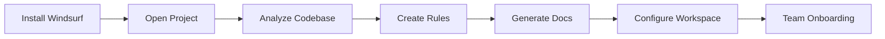

# Adding Windsurf to Existing Projects

## Overview

Integrating Windsurf into an existing project can significantly enhance your development workflow by providing AI-powered assistance that understands your codebase context. This guide walks you through the complete migration process, from initial setup to advanced configuration.

**What you'll achieve:**
- AI assistant that understands your project's architecture and conventions
- Consistent code quality across your team
- Automated documentation generation and maintenance
- Faster onboarding for new team members
- Reduced context-switching during development

**Time Investment:** 2-4 hours for initial setup, ongoing refinement as needed

---

## Prerequisites

Before starting, ensure you have:

- [ ] Windsurf IDE installed ([Download here](https://codeium.com/windsurf/download))
- [ ] Admin or lead developer access to the project
- [ ] Understanding of your project's tech stack and architecture
- [ ] Git repository with recent commits
- [ ] Team alignment on adopting AI-assisted development

---

## Migration Roadmap



---

## Step-by-Step Migration Guide

### Step 1: Install and Setup Windsurf

**1.1 Download and Install**
- Download Windsurf from [official website](https://codeium.com/windsurf/download)
- Install for your OS (macOS, Windows, or Linux)
- Launch Windsurf and sign in/create account

**1.2 Import VS Code Settings (Optional)**
If you're coming from VS Code, Windsurf will prompt you to import:
- Extensions
- Keybindings
- Settings
- Themes

**1.3 Open Your Existing Project**
```bash
# Option 1: From terminal
cd /path/to/your/project
windsurf .

# Option 2: From Windsurf
File > Open Folder > Select your project directory
```

---

### Step 2: Initial Codebase Analysis

**2.1 Let Windsurf Index Your Project**

When you first open your project, Windsurf will automatically start indexing. This process:
- Analyzes your file structure
- Identifies programming languages and frameworks
- Builds a semantic understanding of your code
- Creates a searchable index for Cascade

**Wait for indexing to complete** (shown in bottom status bar)

**2.2 Verify Project Recognition**

Open Cascade panel (right sidebar) and ask:
```
What type of project is this? What frameworks and libraries are being used?
```

Cascade should identify:
- Programming language(s)
- Framework (React, Vue, Angular, etc.)
- Build tools (Webpack, Vite, etc.)
- Package manager (npm, yarn, pnpm)
- Major dependencies

---

### Step 3: Create Project Rules

**Why Rules Matter:**

Without rules, Cascade might:
- ❌ Use different coding styles than your team
- ❌ Suggest outdated library versions
- ❌ Ignore your project's architectural patterns
- ❌ Generate code that breaks existing features

With rules, Cascade will:
- ✅ Follow your team's conventions
- ✅ Use correct library versions
- ✅ Respect your architecture
- ✅ Generate consistent, production-ready code

**3.1 Analyze Your Project Structure**

Use Cascade to analyze your codebase. **Recommended: Use Claude Sonnet 4 or GPT-4o for this analysis.**

**Prompt:**
```
Analyze this project comprehensively and create detailed IDE rules based on this template:

## Required Sections:
- Instructions for AI Assistants (include library version checking)
- Code Style & Structure (formatting, organization)
- Language Configuration (TypeScript/JavaScript settings)
- Naming Conventions (files, variables, functions, classes)
- State Management (if applicable)
- UI & Styling (frameworks, methodologies)
- Performance Optimization (best practices)
- Form & Validations (if applicable)
- Error Handling and Validation
- Translations/i18n (if applicable)
- Services and HTTP Calls (API patterns)
- Testing Requirements
- Project Structure (folder organization)

Please analyze:
1. package.json for exact dependency versions
2. Existing code patterns and conventions
3. ESLint/Prettier configurations
4. TypeScript config (if applicable)
5. Folder structure and module organization

Generate comprehensive rules that will prevent breaking changes and maintain consistency.
```

**3.2 Review and Refine the Generated Rules**

Cascade will generate a comprehensive rules document. Review it carefully:
- ✅ Verify all library versions are correct
- ✅ Check that coding patterns match your team's style
- ✅ Ensure architectural decisions are captured
- ✅ Add any missing project-specific requirements

**3.3 Save Rules to Your Project**

Create a `.windsurf` directory in your project root:

```bash
mkdir -p .windsurf/rules
```

Save the rules file:
```bash
# Create the rules file
touch .windsurf/rules/project-conventions.md
```

Copy the generated rules into this file.

**3.4 Configure Workspace Rules in Windsurf**

1. Open Cascade panel (right sidebar)
2. Click the **Customizations** icon (⚙️) in top-right
3. Navigate to **Rules** tab
4. Click **+ Workspace**
5. Paste your rules or reference the file

**Alternative: Use Global Rules**

For rules that apply across all your projects:
```bash
# Create global rules file
~/.windsurf/global_rules.md
```

---

### Step 4: Generate Project Documentation

**4.1 Generate/Update README.md**

**Prompt:**
```
Read through the current project and generate a comprehensive README.md file including:

1. Project title and description
2. Tech stack and dependencies
3. Prerequisites for development
4. Installation instructions
5. Development commands (dev, build, test, lint)
6. Environment variables setup
7. Project structure overview
8. Deployment instructions
9. Contributing guidelines
10. Common troubleshooting issues

Make it beginner-friendly but comprehensive.
```

**4.2 Review and Commit**

- Review the generated README
- Make any necessary adjustments
- Commit to your repository:
```bash
git add README.md
git commit -m "docs: update README with comprehensive project documentation"
```

**4.3 Generate Additional Documentation**

Consider generating:
- **CONTRIBUTING.md** - Contribution guidelines
- **ARCHITECTURE.md** - System architecture overview
- **API.md** - API documentation
- **CHANGELOG.md** - Version history

**Prompt for CONTRIBUTING.md:**
```
Based on the project structure and conventions, create a CONTRIBUTING.md file that includes:
- How to set up the development environment
- Code style guidelines
- Branch naming conventions
- Commit message format
- Pull request process
- Testing requirements
```

---

### Step 5: Configure Windsurf Features

**5.1 Set Up Memories**

Memories help Cascade remember important project context across conversations.

**Create initial memories:**
```
Create a memory about:
1. The main purpose and goals of this project
2. Key architectural decisions and why they were made
3. Common pitfalls or gotchas in this codebase
4. Performance considerations specific to this project
```

**Access Memories:**
- Click Customizations (⚙️) → Memories tab
- View, edit, or delete memories as needed

**5.2 Configure Ignore Files**

Tell Windsurf which files to ignore:

Create `.codeiumignore` in project root:
```
# Dependencies
node_modules/
vendor/
.pnp/

# Build outputs
dist/
build/
out/
.next/

# Environment files
.env
.env.local
.env.*.local

# IDE
.vscode/
.idea/

# Test coverage
coverage/
.nyc_output/

# Logs
*.log
logs/

# Large data files
*.csv
*.json.gz
data/

# Generated files
*.generated.*
```

**5.3 Enable Useful Features**

Configure these Cascade features:
- ✅ **Auto-continue**: Automatically continue when hitting tool call limits
- ✅ **Turbo Mode**: Faster command execution for safe operations
- ✅ **Terminal Integration**: Allow Cascade to run commands
- ✅ **Web Search**: Enable for documentation lookups

---

### Step 6: Test the Integration

**6.1 Simple Code Generation Test**

Test that Cascade follows your rules:

**Prompt:**
```
@project-conventions.md Create a new utility function that formats dates according to our project standards.
```

Verify that the generated code:
- Uses the correct date library (dayjs, date-fns, etc.)
- Follows your naming conventions
- Includes proper TypeScript types
- Matches your code style

**6.2 Refactoring Test**

**Prompt:**
```
@project-conventions.md Refactor the [ComponentName] to improve readability while maintaining all functionality.
```

Check that Cascade:
- Doesn't change the component's behavior
- Follows your architectural patterns
- Maintains consistent style
- Adds helpful comments if needed

**6.3 Bug Fix Test**

Create a small intentional bug and ask Cascade to fix it:

**Prompt:**
```
There's a bug in [file-name.ts] where [describe the bug]. Please fix it following our project conventions.
```

---

### Step 7: Team Onboarding

**7.1 Create Team Documentation**

Create a `WINDSURF_GUIDE.md` in your project:

```markdown
# Windsurf Setup Guide for Team Members

## Quick Start

1. Install Windsurf: https://codeium.com/windsurf/download
2. Clone the repository
3. Open project in Windsurf
4. Wait for indexing to complete
5. Rules are automatically loaded from `.windsurf/rules/`

## Using Cascade

### Before You Start
- Always reference @project-conventions.md in your prompts
- Let Cascade analyze before making changes
- Review all generated code before accepting

### Common Prompts

**Adding a Feature:**
```
@project-conventions.md I need to add [feature description]. 
Please analyze the existing code and implement this following our patterns.
```

**Fixing a Bug:**
```
@project-conventions.md There's a bug in [file] where [description]. 
Please fix it without changing other functionality.
```

**Code Review:**
```
Review this code for potential issues and suggest improvements 
based on our project conventions.
```

## Best Practices

1. ✅ Always use @-mentions for rules and files
2. ✅ Review generated code before accepting
3. ✅ Test changes locally before committing
4. ✅ Use descriptive prompts
5. ❌ Don't blindly accept all suggestions
6. ❌ Don't let Cascade modify critical files without review
```

**7.2 Share Example Prompts**

Create a prompt library for common tasks:

<details>
<summary>Example Prompt Library</summary>

```markdown
# Windsurf Prompt Library

## Component Creation
```
@project-conventions.md Create a new [ComponentName] component that:
- Accepts [props list]
- Handles [functionality]
- Follows our component structure
```

## API Integration
```
@project-conventions.md Create a service function to call the [endpoint-name] API:
- Method: POST/GET/PUT/DELETE
- Request payload: [describe]
- Response handling: [describe]
- Error handling per our standards
```

## Bug Fixes
```
@project-conventions.md Fix the issue in @[file-path] where [describe bug].
Maintain all existing functionality and add tests.
```

## Refactoring
```
@project-conventions.md Refactor @[file-path] to:
- Improve readability
- Extract reusable logic
- Maintain current behavior
- Add proper TypeScript types
```

## Testing
```
@project-conventions.md Generate unit tests for @[file-path] covering:
- Happy path scenarios
- Edge cases
- Error handling
```

## Documentation
```
@project-conventions.md Add JSDoc comments to @[file-path] explaining:
- Function purpose
- Parameters
- Return values
- Usage examples
```
```

</details>

**7.3 Conduct Team Training Session**

Schedule a 1-hour session covering:
1. **Introduction (10 min)**: What is Windsurf and why we're using it
2. **Setup (15 min)**: Live walkthrough of installation and configuration
3. **Basic Usage (20 min)**: Demonstrate common prompts and features
4. **Best Practices (10 min)**: Do's and don'ts
5. **Q&A (5 min)**: Address concerns and questions

---

## Advanced Configuration

### Using MCP (Model Context Protocol)

MCP servers extend Cascade's capabilities with external tools.

**Example: Add GitHub Integration**

1. Install MCP server:
```bash
npm install -g @modelcontextprotocol/server-github
```

2. Configure in `.windsurf/mcp_config.json`:
```json
{
  "mcpServers": {
    "github": {
      "command": "npx",
      "args": ["-y", "@modelcontextprotocol/server-github"],
      "env": {
        "GITHUB_TOKEN": "${GITHUB_TOKEN}"
      }
    }
  }
}
```

### Creating Workflows

Automate repetitive tasks with Windsurf Workflows.

**Example: PR Review Workflow**

Create `.windsurf/workflows/pr-review.md`:
```markdown
# PR Review Workflow

## Steps:
1. Analyze changed files
2. Check for code style violations
3. Verify test coverage
4. Suggest improvements
5. Generate review summary

## Prompt:
Review the current changes and provide:
- Code quality assessment
- Potential bugs or issues
- Performance considerations
- Security concerns
- Suggestions for improvement
```

Trigger with: `@pr-review.md`

---

## Best Practices

### Do's ✅

1. **Always use @-mentions** for rules and important files
2. **Review generated code** before accepting changes
3. **Test locally** before committing
4. **Update rules** as your project evolves
5. **Create memories** for important decisions
6. **Use specific prompts** rather than vague requests
7. **Leverage web search** for latest documentation
8. **Keep rules file updated** with library versions

### Don'ts ❌

1. **Don't blindly accept** all suggestions
2. **Don't skip code review** for AI-generated code
3. **Don't let Cascade modify** critical config files without review
4. **Don't forget to test** after accepting changes
5. **Don't use Cascade** for security-sensitive operations without verification
6. **Don't ignore warnings** from Cascade about potential issues
7. **Don't commit** without reviewing diffs
8. **Don't share sensitive data** in prompts

---

## Troubleshooting

### Cascade Not Following Rules

**Problem**: Generated code doesn't match your conventions

**Solutions**:
1. Ensure rules file is in `.windsurf/rules/` directory
2. Reference rules explicitly: `@project-conventions.md`
3. Check rules are loaded in Customizations panel
4. Restart Windsurf to reload rules
5. Make rules more specific and detailed

### Slow Indexing

**Problem**: Project indexing takes too long

**Solutions**:
1. Add large files/folders to `.codeiumignore`
2. Exclude `node_modules`, `dist`, `build` directories
3. Check available disk space
4. Restart Windsurf
5. Consider using Remote Indexing for large repos

### Incorrect Code Suggestions

**Problem**: Cascade suggests outdated or wrong patterns

**Solutions**:
1. Update rules with correct library versions
2. Add specific examples to rules
3. Create memories about common mistakes
4. Use more descriptive prompts
5. Reference specific files with @-mentions

### Context Not Maintained

**Problem**: Cascade forgets previous conversation context

**Solutions**:
1. Create memories for important information
2. Reference previous messages explicitly
3. Use @-mentions for files and rules
4. Keep conversations focused on single topics
5. Start new conversation for unrelated tasks

---

## Maintenance and Updates

### Monthly Tasks

- [ ] Review and update project rules
- [ ] Update library versions in rules
- [ ] Clean up old memories
- [ ] Review team's Cascade usage patterns
- [ ] Update prompt library with new patterns

### Quarterly Tasks

- [ ] Audit generated code quality
- [ ] Gather team feedback
- [ ] Update documentation
- [ ] Review and optimize workflows
- [ ] Train new team members

### When Dependencies Change

1. Update rules file with new versions
2. Test Cascade with new dependencies
3. Update prompt library if needed
4. Notify team of changes
5. Document breaking changes

---

## Example: Real Project Migration

Here's a complete example of rules generated for a Vue.js project:

<details>
<summary>Click to view example rules</summary>

``````markdown
# Project Name - IDE AI Assistant Rules
# Stack: Vue 3.4 + TypeScript 5.3 + Vite 5.0

## Instructions for AI Assistants

### Critical Version Rules
1. **ALWAYS verify library versions before suggesting code**
2. **Vue 2.7.16** - NOT Vue 3 (different API)
3. **Vuetify 2.6.15** - NOT Vuetify 3 (different components)
4. **AG Grid 28.2.1** - NOT v29+ (breaking changes)
5. **ALWAYS use TypeScript** - No plain JavaScript
6. **PREFER minimal edits** - Don't rewrite entire files
7. **NO emojis in code** - Only in docs if requested

### Library Versions to Check
- vue@2.7.16, vuetify@2.6.15, @ag-grid-community/*@28.2.1
- pinia@2.0.35, axios@1.4.0, @tanstack/vue-query@4.29.7
- @vuelidate/core@2.0.3, lodash@4.17.21, dayjs@1.11.10

---

## Code Style & Structure

### Import Order (auto-sorted by Prettier)
```typescript
// 1. Type imports (import type)
import type { GridApi } from '@ag-grid-community/core';

// 2. External libs (sorted)
import { ref, computed } from 'vue';
import { storeToRefs } from 'pinia';

// 3. @/app/*
import config from '@/app/config';

// 4. @/common/*
import http from '@/common/http';

// 5. @/* (modules)
import { useMyStore } from '@/Module/stores';

// 6. @v4/*
import Component from '@v4/common/components/Component.vue';

// 7. Relative (./ ../)
import { DEFAULT_FILTER } from '../filter';
```

### Vue Component Structure
```vue
<script setup lang="ts">
// 1. Type imports
// 2. Library imports
// 3. App imports (by alias order)
// 4. Props & Emits (defineProps/defineEmits)
// 5. Composables & Store (with storeToRefs)
// 6. Reactive state (ref, reactive)
// 7. Computed properties
// 8. Watchers
// 9. Methods (grouped by functionality)
// 10. Lifecycle hooks
// 11. defineExpose (if needed)
</script>

<template>
  <!-- Use camelCase for attributes -->
</template>

<style scoped lang="scss">
/* Styles */
</style>

<i18n lang="yaml">
en:
  key: 'English'
id:
  key: 'Indonesian'
</i18n>
```

### Formatting (Prettier)
- Single quotes, 2 spaces, trailing commas
- Import order with separation

---

## Language Configuration

### TypeScript
```typescript
// ✅ Always annotate return types
async function fetchData(id: string): Promise<DataType> {
  return await http.get(`/api/${id}`);
}

// ✅ Annotate refs with complex types
const users = ref<UserInterface[]>([]);

// ✅ Use type for object shapes
type FormData = {
  name: string;
  email: string;
};

// ✅ Use interface for data models
interface UserInterface {
  id: string;
  name: string;
}

// ✅ Use enum for fixed values
enum Status {
  Active = 'active',
  Inactive = 'inactive',
}
```

---

## Naming Conventions

### Files
- Components: `PascalCase.vue`
- Composables: `useCamelCase.ts`
- Services: `camelCaseServices.ts`
- Types/Interfaces: `PascalCaseType.ts` or `PascalCaseInterface.ts`
- Stores: `index.ts` in folder

### Variables
- Variables: `camelCase`
- Constants: `SCREAMING_SNAKE_CASE`
- Booleans: `isActive`, `hasError`, `shouldShow`
- Handlers: `handleClick`, `handleSubmit`

### Types
- Interfaces: `TransactionInterface`
- Types: `FormDataType`
- Enums: `StepPrepopulation`
- Props: `ComponentNameProps`

---

## State Management (Pinia)

```typescript
export const useModuleStore = defineStore('MODULE/NAME', {
  state: () => ({
    data: [] as DataType[],
    loading: false,
    error: null as Error | null,
  }),
  
  getters: {
    filteredData: (state) => state.data.filter(item => item.active),
  },
  
  actions: {
    async loadData(params: ParamsType) {
      this.loading = true;
      try {
        const response = await apiCall(params);
        this.data = response.data;
        return response;
      } catch (error) {
        this.error = error as Error;
        throw error;
      } finally {
        this.loading = false;
      }
    },
  },
});

// Usage in component:
const store = useModuleStore();
const { data, loading } = storeToRefs(store);  // Reactive
const { loadData } = store;  // Actions
```

---

## UI & Styling

### Vuetify 2 Components
```vue
<v-dialog v-model="show" width="90vw" persistent>
  <v-card>
    <v-card-title>Title</v-card-title>
    <v-card-text>Content</v-card-text>
  </v-card>
</v-dialog>

<v-text-field
  v-model="value"
  label="Label"
  outlined
  hideDetails="auto"
  :errorMessages="errors"
/>

<v-btn outlined @click="handleClick">
  <span>Click</span>
</v-btn>

<v-icon>mdi-close</v-icon>
```

### TailwindCSS
```vue
<div class="flex items-center justify-between gap-4 px-6 py-4">
  <span class="text-xl font-bold text-opBlack-200">Title</span>
  <button class="cursor-pointer hover:bg-gray-100">Action</button>
</div>
```

### Custom Colors
- `opRed-400`, `opGray-200`, `opGray-400`
- `opBlack-200`, `opGreen-300`, `opYellow-600`

---

## Performance Optimization

### Lazy Loading
```typescript
// Routes
const routes = [
  {
    path: '/feature',
    component: () => import('@/Feature/views/FeatureView.vue'),
  },
];

// Components
const HeavyComponent = defineAsyncComponent(() =>
  import('./HeavyComponent.vue')
);
```

### Computed & Memoization
```typescript
// Use computed for derived state
const filteredList = computed(() => {
  return list.value.filter(item => item.active);
});

// Debounce expensive operations
import { useDebounceFn } from '@vueuse/core';

const debouncedSearch = useDebounceFn((query: string) => {
  performSearch(query);
}, 300);
```

### AG Grid Optimization
```typescript
// Use server-side row model for large datasets
const datasource = getServerSideDatasource({ getData });
gridApi.value.setServerSideDatasource(datasource);

// Enable virtualization
{
  rowModelType: 'serverSide',
  cacheBlockSize: 100,
  maxBlocksInCache: 10,
}
```

---

## Form & Validations

### Vuelidate Pattern
```typescript
import { useForm } from '@v4/common/composables/useForm';
import { required, email } from '@vuelidate/validators';

type FormValues = {
  email: string;
  name: string;
};

const schema = {
  email: { required, email },
  name: { required },
};

const { formValues, getErrorMessage, submit } = useForm<FormValues>({
  defaultValues: { email: '', name: '' },
  rules: schema,
  resetOnMounted: false,
});

// In template:
<v-text-field
  v-model="formValues.email"
  :errorMessages="getErrorMessage('email')"
/>
```

### Form Submission
```typescript
async function handleSubmit() {
  const isValid = await submit();
  if (!isValid) return;
  
  try {
    await submitData(formValues);
    // Handle success
  } catch (error) {
    // Handle error
  }
}
```

---

## Error Handling and Validation

### API Error Handling
```typescript
async function loadData(id: string) {
  try {
    const response = await http.get(`/api/data/${id}`);
    return response.data;
  } catch (error) {
    // Log error
    console.error('Failed to load data:', error);
    
    // Show user-friendly message
    const message = _.get(error, 'response.data.error.message', 'Unknown error');
    showErrorNotification(message);
    
    // Re-throw or return default
    throw error;
  }
}
```

### Input Validation
```typescript
// Runtime validation with Zod
import { z } from 'zod';

const userSchema = z.object({
  email: z.string().email(),
  age: z.number().min(0).max(120),
});

try {
  const validated = userSchema.parse(input);
} catch (error) {
  if (error instanceof z.ZodError) {
    // Handle validation errors
  }
}
```

### Guard Clauses
```typescript
function processData(data: DataType | null) {
  if (!data) return;
  if (!data.id) {
    console.warn('Data missing ID');
    return;
  }
  
  // Process valid data
  performOperation(data);
}
```

---

## Translations (i18n)

### Component Level
```vue
<template>
  <div>
    <h1>{{ $t('title') }}</h1>
    <p>{{ $tc('items', count) }}</p>
  </div>
</template>

<i18n lang="yaml">
en:
  title: 'Component Title'
  items: 'Item | Items'
  submit: 'Submit'
id:
  title: 'Judul Komponen'
  items: 'Item | Item-item'
  submit: 'Kirim'
</i18n>
```

### Dynamic Keys
```typescript
const message = $t(`status.${status}`);
const label = $t('form.fields.email');
```

### Pluralization
```typescript
$tc('message', count, { count })
```

---

## Services and HTTP Calls

### API Service Pattern
```typescript
// services/PrepopulationServices.ts
import http from '@/common/http';

import type { TransactionInterface } from '../interfaces/TransactionInterface';
import type { LoadRequestType } from '../contracts/LoadRequestType';

const BASE_URL = '/api/v1/purchase-invoices/prepopulated';

export async function getTransactionList(
  payload: LoadRequestType
): Promise<{ data: TransactionInterface[]; meta: { sync: boolean } }> {
  const response = await http.post(BASE_URL, payload);
  return response.data;
}

export async function uploadTransaction(
  payload: TransactionInterface
) {
  const response = await http.put(BASE_URL, { data: payload });
  return response;
}

export async function deleteTransaction(id: string) {
  const response = await http.delete(`${BASE_URL}/${id}`);
  return response.data;
}
```

### Using Services in Store
```typescript
import { getTransactionList } from '../services/PrepopulationServices';

export const useStore = defineStore('STORE', {
  actions: {
    async loadData(params) {
      const response = await getTransactionList(params);
      this.data = response.data;
      return response;
    },
  },
});
```

### Using Services in Components (via Vue Query)
```typescript
import { useQuery, useMutation } from '@tanstack/vue-query';
import { getTransactionList, uploadTransaction } from '../services';

// Query (GET)
const { data, isLoading, error } = useQuery({
  queryKey: ['transactions', filter],
  queryFn: () => getTransactionList(filter),
});

// Mutation (POST/PUT/DELETE)
const { mutateAsync } = useMutation({
  mutationFn: (payload) => uploadTransaction(payload),
  onSuccess: () => {
    // Refetch or invalidate
  },
});
```

### Async Patterns

#### Standard Async/Await
```typescript
async function loadData() {
  loading.value = true;
  try {
    const response = await apiCall();
    data.value = response.data;
  } catch (error) {
    handleError(error);
  } finally {
    loading.value = false;
  }
}
```

#### Polling (Blocking until complete)
```typescript
async function pollUntilComplete() {
  let isComplete = false;
  
  while (!isComplete) {
    const response = await checkStatus();
    
    if (response.meta?.sync) {
      await new Promise(resolve => setTimeout(resolve, 15000));
    } else {
      isComplete = true;
    }
  }
  
  return response.data;
}
```

#### Parallel Requests
```typescript
const [users, products, orders] = await Promise.all([
  fetchUsers(),
  fetchProducts(),
  fetchOrders(),
]);
```

---

## Common Patterns

### Loading States
```typescript
const isLoading = ref(false);

async function fetchData() {
  isLoading.value = true;
  try {
    const data = await apiCall();
    return data;
  } finally {
    isLoading.value = false;
  }
}
```

### Debounced Search
```typescript
import { useDebounceFn } from '@vueuse/core';

const debouncedSearch = useDebounceFn((keyword: string) => {
  performSearch(keyword);
}, 300);
```

### AG Grid Server-Side
```typescript
const getData = async (request: IServerSideGetRowsRequest) => {
  const response = await loadData({
    startRow: request.startRow,
    endRow: request.endRow,
  });
  
  return {
    success: true,
    rowData: response.data,
    cacheBlockSize: pageSize,
  };
};

const datasource = getServerSideDatasource({ getData });
gridApi.value.setServerSideDatasource(datasource);
```

### Response Code Handling
```typescript
import { Transaction } from '@/common/responseCode';

const code = _.get(response, 'data.success.code');
if (code === Transaction.PurchaseInvoiceCreated) {
  // Handle success
}
```

---

## Testing

### Unit Test Pattern
```typescript
import { describe, it, expect, vi } from 'vitest';
import { mount } from '@vue/test-utils';
import Component from './Component.vue';

describe('Component', () => {
  it('should render correctly', () => {
    const wrapper = mount(Component, {
      props: { userId: '123' },
    });
    
    expect(wrapper.text()).toContain('User');
  });
  
  it('should handle click', async () => {
    const wrapper = mount(Component);
    await wrapper.find('button').trigger('click');
    
    expect(wrapper.emitted('submit')).toBeTruthy();
  });
});
```

---

## Project Structure

```
src/modules/Feature/SubFeature/
├── components/      # UI components
├── composables/     # Reusable composition functions
├── contracts/       # Request/Response types
├── enums/           # Enumerations
├── interfaces/      # Data interfaces
├── services/        # API services
├── stores/          # Pinia stores
├── types/           # Type definitions
├── views/           # Page components
├── consts.ts        # Constants
├── filter.ts        # Filter definitions
└── routes.ts        # Route definitions
```
---

## Quick Reference

### Path Aliases
- `@/app/*` → `src/app/*`
- `@/common/*` → `src/common/*`
- `@/*` → `src/modules/*`
- `@v4/*` → `src/v4/*`

### Scripts
- `npm run dev` - Development
- `npm run build:production` - Build
- `npm run lint:fix` - Fix lint
- `npm run format` - Format code
- `npm run test` - Run tests

### Key Libraries
- State: Pinia 2.0.35
- HTTP: Axios 1.4.0
- Data Fetch: @tanstack/vue-query 4.29.7
- Forms: @vuelidate/core 2.0.3
- Grid: AG Grid 28.2.1
- Utils: lodash 4.17.21, dayjs 1.11.10

---

Last Updated: 2025-10-07
``````

</details>

---

## Quick Reference

### Essential Commands

```bash
# Create rules directory
mkdir -p .windsurf/rules

# Create ignore file
touch .codeiumignore

# Create workflows directory
mkdir -p .windsurf/workflows

# Create MCP config
touch .windsurf/mcp_config.json
```

### Key @-Mentions

- `@project-conventions.md` - Reference your project rules
- `@file-path` - Reference specific files
- `@folder/` - Reference entire directories
- `@workflow-name.md` - Trigger custom workflows

### Useful Prompts

**Quick Analysis:**
```
Analyze this project and summarize the tech stack, architecture, and main features.
```

**Generate Tests:**
```
@project-conventions.md Generate comprehensive tests for @[file-path]
```

**Refactor Code:**
```
@project-conventions.md Refactor @[file-path] to improve maintainability
```

**Documentation:**
```
Generate JSDoc comments for all functions in @[file-path]
```

---

## Resources

### Official Documentation
- [Windsurf Docs](https://docs.windsurf.com)
- [Cascade Guide](https://docs.windsurf.com/windsurf/cascade)
- [MCP Documentation](https://docs.windsurf.com/windsurf/mcp)

### Community
- [Windsurf Discord](https://discord.gg/codeium)
- [GitHub Discussions](https://github.com/Exafunction/codeium-vscode/discussions)

### Related Guides
- [Project Initialization Guide](./project-initialization.md)
- [Cascade Essentials](../essentials/cascade.md)
- [Workflows Guide](../productivity-tools/workflows.md)

---

## Conclusion

Successfully integrating Windsurf into your existing project requires:

1. ✅ **Proper Setup** - Install, configure, and index your project
2. ✅ **Clear Rules** - Define comprehensive project conventions
3. ✅ **Documentation** - Generate and maintain project docs
4. ✅ **Team Alignment** - Onboard and train your team
5. ✅ **Continuous Improvement** - Regularly update rules and practices

**Expected Benefits:**
- 40-60% faster feature development
- More consistent code quality
- Reduced onboarding time for new developers
- Better documentation maintenance
- Fewer bugs from inconsistent patterns

**Next Steps:**
1. Complete the migration checklist
2. Monitor team adoption and gather feedback
3. Refine rules based on real usage
4. Explore advanced features (MCP, Workflows)
5. Share learnings with the community

---

**Need Help?** Check the [troubleshooting section](#troubleshooting) or reach out to the Windsurf community.

**Ready to start?** Begin with [Step 1: Install and Setup Windsurf](#step-1-install-and-setup-windsurf)